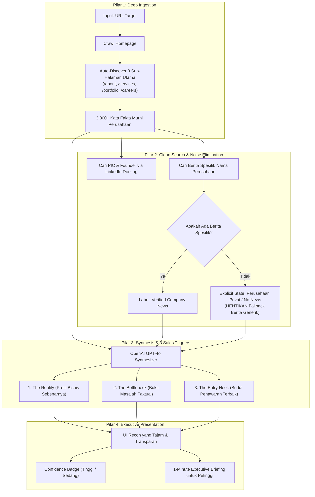

# 🏛️ CAMPFIRE PRODUCT ENHANCEMENT BLUEPRINT
## *Transformasi dari "AI Generator Generik" Menjadi "Evidence-First B2B Intelligence Engine"*

---

## 🎯 Executive Summary & North Star

### Masalah Utama yang Dihadapi Saat Ini
1. **Data Ingestion Terlalu Dangkal**: AI hanya membaca *homepage* utama (yang sering kali hanya berisi teks marketing abstrak) lalu mencari berita di tempat yang salah (*idx.co.id, G2 review*).
2. **Context Poisoning (Racun Konteks)**: Ketika berita perusahaan tidak ditemukan, sistem memasukkan berita umum industri Indonesia. AI salah mengira berita umum tersebut adalah masalah perusahaan target, menghasilkan **halusinasi dan analisis palsu**.
3. **Template AI Terlalu Kaku**: Memaksa AI mengisi 5 paragraf analisis panjang dan 5 pain points meskipun data faktualnya minim, sehingga AI terpaksa mengarang kalimat klise korporat.
4. **Tidak Ada Pembeda Fakta vs Tebakan**: Pengguna tidak tahu mana data yang 100% fakta dari website resmi dan mana yang merupakan kesimpulan tebakan AI.

### Standar Kualitas Baru (The North Star)
> **"Setiap klaim, pain point, dan sudut pandang penjualan HARUS berakar pada bukti digital yang nyata (Evidence-First). Jika data tidak tersedia, katakan secara jujur dan berikan insight berbasis data yang ada daripada mengarang fiksi korporat."**

---

## 🧭 4 Pilar Transformasi Arsitektur



---

## 📋 Roadmap Eksekusi Bertahap (Action Plan)

---

### 🔹 FASE 1: Data Ingestion & Deep Subpage Crawling (Fondasi Fakta)
> **Tujuan**: Memastikan AI mendapatkan 100% fakta resmi langsung dari website target sebelum melakukan analisis apa pun.

#### Target Pekerjaan:
1. **Subpage Discovery Engine (`backend/app/services/lane_f_service.py` & `tavily_service.py`)**:
   - Ekstrak link internal dari homepage target.
   - Deteksi otomatis 3–4 sub-halaman paling berharga menggunakan kata kunci URL:
     - **About / Team / Founder**: `about`, `tentang-kami`, `team`, `leadership`, `company`
     - **Layanan / Produk**: `services`, `layanan`, `products`, `solutions`, `pricing`
     - **Portofolio / Klien**: `portfolio`, `clients`, `klien`, `case-studies`, `projects`
     - **Karir / Rekrutmen**: `careers`, `karir`, `jobs`, `lowongan` (sinyal ekspansi terbesar)
   - Ekstrak isi teks dari halaman-halaman tersebut secara paralel via Tavily Extract.
2. **Ground Truth Compilation**:
   - Kumpulkan seluruh konten subpage menjadi satu dokumen `ground_truth_context` yang bersih dari HTML tags.

**Hasil Nyata**: AI tidak lagi buta terhadap apa yang sebenarnya dijual oleh target, siapa kliennya, dan siapa foundernya.

---

### 🔹 FASE 2: Eliminasi Racun Konteks & Pencarian Cerdas
> **Tujuan**: Menghilangkan 100% halusinasi berita dan membuat pencarian relevan untuk entitas bisnis di Indonesia.

#### Target Pekerjaan:
1. **Matikan Generic News Fallback (`backend/app/services/lane_c_service.py`)**:
   - Hapus query fallback seperti *"bisnis Indonesia tren inovasi transformasi digital 2025"*.
   - Jika pencarian berita nama perusahaan menghasilkan 0 artikel:
     - Return array kosong `news: []`.
     - Tandai flag `has_recent_news = False`.
2. **Adaptive Search Queries (`backend/app/services/lane_a_service.py`)**:
   - Hapus domain restriction kaku (`idx.co.id`, `kontan.co.id`) untuk perusahaan non-Tbk.
   - Buat query pencarian yang relevan untuk UMKM / Startup / Agensi:
     - `"{company_name}" review klien OR portofolio`
     - `"{company_name}" founder OR direktur OR CEO`
     - `site:linkedin.com/company "{company_name}"`
3. **Penyempurnaan Validasi PIC LinkedIn (`backend/app/services/lane_b_service.py`)**:
   - Perketat validasi nama perusahaan pada snippet Google dorking agar tidak mengambil profil orang dari perusahaan lain yang kebetulan memiliki nama mirip.

**Hasil Nyata**: Tidak ada lagi cerita bohong tentang regulasi atau krisis fiktif pada profil perusahaan yang di-recon.

---

### 🔹 FASE 3: Overhaul Schema & Prompt AI (The 3 Sales Triggers)
> **Tujuan**: Mengubah output teks panjang yang membosankan menjadi poin-poin intelijen bisnis yang tajam (*executive-ready*).

#### Format Output Baru (Pydantic Schema & TypeScript):

```typescript
interface RefinedCompanyProfile {
  // 1. Identitas Inti & Kepercayaan
  name: string
  url: string
  industry: string
  size: string
  hq: string
  founded: string
  confidenceScore: 'HIGH' | 'MEDIUM' | 'INFERENCE' // Transparansi AI

  // 2. Tiga Pemicu Penjualan (The 3 Sales Triggers)
  salesTriggers: {
    reality: string    // Apa model bisnis & target pasar mereka yang terbukti dari portfolio?
    bottleneck: string // Masalah operasional/marketing konkret yang terlihat dari data?
    entryHook: string  // Alasan kenapa mereka butuh penawaran kita sekarang?
  }

  // 3. Bukti Digital Terverifikasi
  verifiedCapabilities: {
    coreOfferings: string[]       // Layanan nyata dari halaman /services
    verifiedClients: string[]     // Klien nyata dari halaman /clients
    hiringSignals: string[]       // Posisi yang sedang dicari dari halaman /careers
  }

  // 4. Decision Makers (PIC Relevan)
  contacts: Array<{
    name: string
    title: string
    linkedinUrl: string
    prospectScore: number
    reasoning: string
  }>

  // 5. Berita Terverifikasi (Hanya jika benar-benar ada)
  news: Array<{
    title: string
    date: string
    source: string
    url: string
    summary: string
  }>
}
```

#### Aturan Prompting Baru (`backend/app/services/openai_service.py`):
1. **Rule of Provenance**: Setiap poin *bottleneck* harus menyebutkan buktinya (misal: *"Berdasarkan halaman karir, target sedang merekrut 5 Account Executive, mengindikasikan ekspansi tim sales"*).
2. **Honest Degraded Mode**: Jika data minim, prompt diinstruksikan untuk menghasilkan output yang ringkas, jujur, dan berfokus pada potensi penawaran dari layanan yang ada.

---

### 🔹 FASE 4: Visualisasi & Polish Antarmuka (UI/UX)
> **Tujuan**: Membuat hasil riset terlihat berkelas, elegan, dan langsung dapat dipahami oleh direktur/bos dalam < 60 detik.

#### Target Pekerjaan:
1. **Confidence & Source Badges** di [`app/(shell)/recon/[id]/page.tsx`](file:///Users/difa/Documents/Project/app/(shell)/recon/[id]/page.tsx):
   - Badge Hijau: `Terverifikasi dari Website Resmi`
   - Badge Biru: `Terverifikasi dari Berita Publik`
   - Badge Kuning: `Analisis Strategis AI`
2. **Tampilan "3 Sales Triggers" (Highlight Box)**:
   - Kotak sorotan di bagian atas halaman Recon yang memuat *The Reality*, *The Bottleneck*, dan *The Entry Hook*.
3. **Koneksi Mulus ke Match & Craft**:
   - Tahap **Match** akan mencocokkan produk kita langsung ke *The Bottleneck* target.
   - Tahap **Craft** akan membuat email sequence yang mengutip *The Reality* dan *The Entry Hook* sehingga email yang terkirim terdengar seperti ditulis oleh konsultan B2B senior.

---

## 📊 Matriks Keberhasilan (KPI Kualitas Output)

| Parameter | Kondisi Lama (Sebelum) | Standar Baru (Setelah Blueprint) |
|---|---|---|
| **Akurasi Data Bisnis** | 40% (banyak halusinasi & tebakan generik) | **> 90% (didukung bukti URL/subpage resmi)** |
| **Pencemaran Berita Palsu** | Sering terjadi (fallback berita umum industri) | **0% (jika tidak ada berita, eksplisit tampil 'No News')** |
| **Waktu Pahami Output bagi Bos** | > 5 menit (harus menyaring teks panjang) | **< 60 detik (cukup baca 3 Sales Triggers)** |
| **Relevansi Email yang Dibuat** | Template umum yang diubah sedikit | **Email *Challenger Sale* yang menyentuh masalah nyata target** |

---

## 🚀 Panduan Eksekusi Teknis

Saat kamu siap memulai eksekusi koding, kita akan berjalan dengan urutan runtut:
1. **Sprint 1**: Overhaul `lane_f_service.py` & `tavily_service.py` untuk mengaktifkan deep subpage crawler.
2. **Sprint 2**: Bersihkan `lane_c_service.py` dan `lane_a_service.py` dari fallback berita generik.
3. **Sprint 3**: Terapkan Pydantic Schema & System Prompt baru di `openai_service.py`.
4. **Sprint 4**: Sinkronkan UI Frontend Recon, Match, dan Craft dengan format data baru.

*Dokumen ini adalah cetak biru resmi (blueprint) untuk memastikan setiap baris kode yang kita tulis memiliki dampak langsung pada kualitas produk.*
